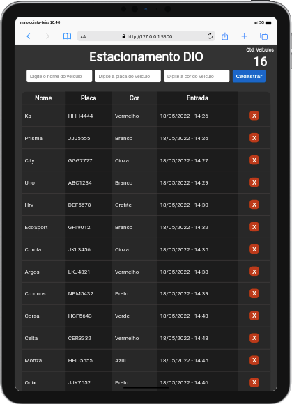

<div align="center">

</div>
<h1 align="center">Estacionamento Dio</h1>
<h4 align="center">This project is my second bootcamp spread challenge - module 3 (JavaScript)</h4>


<p align="center">
  
  
  
  
</p>

<p align="center">
    
    
    
</p>

## About this project  
This project is my second bootcamp **spread** challenge .  


## How to use
To clone and run this project, you'll need **[Git](https://git-scm.com)**, **[node v14.19](https://nodejs.org/en/)** or higher installed on your computer. From your command line:
```bash
#Clone this repository
$ git clone https://github.com/RenanTRS/estacionamento-dio.git

#Go into the repository
$ cd estacionamento-dio

#Transpile to javascript
$ npx -p typescript tsc

#If you use vscode
$ code .

#Press
Ctrl + Shift + P

#Type it
Live Server: Open with Live Server
```

## Built with  
- [TypeScript](https://www.typescriptlang.org/)

## Contact
- Email me - renantrsouza@gmail.com  
- Connect with me on [LinkedIn](https://www.linkedin.com/in/renantrsouza/)

## License
This project is licensed under the MIT License - see the [LICENSE](https://github.com/renantrs/estacionamento-dio/blob/main/LICENSE) file for details.